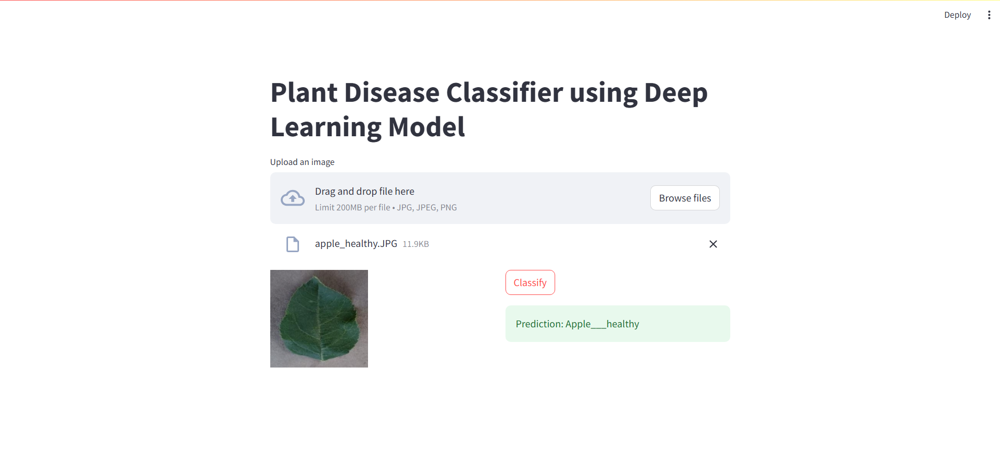
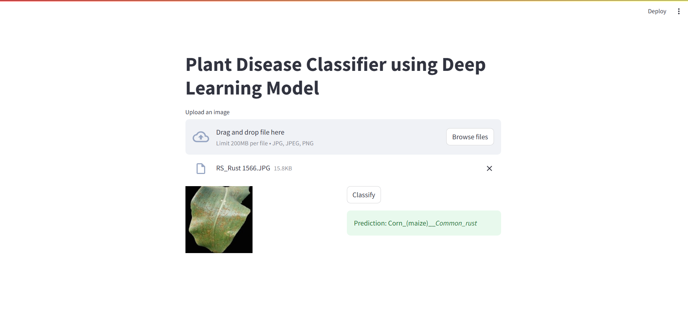

# Deep Learning Plant Disease Prediction

## Overview

This project implements a Convolutional Neural Network (CNN) for image classification in Python, specifically designed for predicting plant diseases.

## Requirements

- Python 3
- TensorFlow
- Keras
- NumPy
- Matplotlib
- Streamlit

## Setting Up Kaggle API

To access datasets from Kaggle within this project, follow these steps to configure the Kaggle API:

1. Create a Kaggle Account:

Go to Kaggle and sign up for a new account or log in to your existing account.

2. Generate Kaggle API Token:

Navigate to your Kaggle account settings by clicking on your profile picture in the top right corner and selecting "My Account".
Scroll down to the "API" section.
Click on the "Create New API Token" button. This action will download a file named kaggle.json to your computer.

3. Move Kaggle API Token to Project Directory:

Place the downloaded kaggle.json file into the base directory of your project.

Following these steps will enable you to seamlessly access Kaggle datasets from within your project.

## Usage

1. Clone the repository:

```
git clone https://github.com/srijosh/Plant-Disease-CNN-Classifier.git
```

2. Install the required dependencies:

```
pip install -r requirements.txt
```

3. Run the " Plant_Disease_Prediction.ipynb " Jupyter Notebook file to train and save the model.

4. Run the streamlit app

```
streamlit run app/main.py
```

## Demo:

<table width="100%"> 
<tr>
<td width="50%">

</td> 
<td width="50%">
  
</td>
</table>

## Kaggle Dataset Link:

https://www.kaggle.com/datasets/abdallahalidev/plantvillage-dataset
